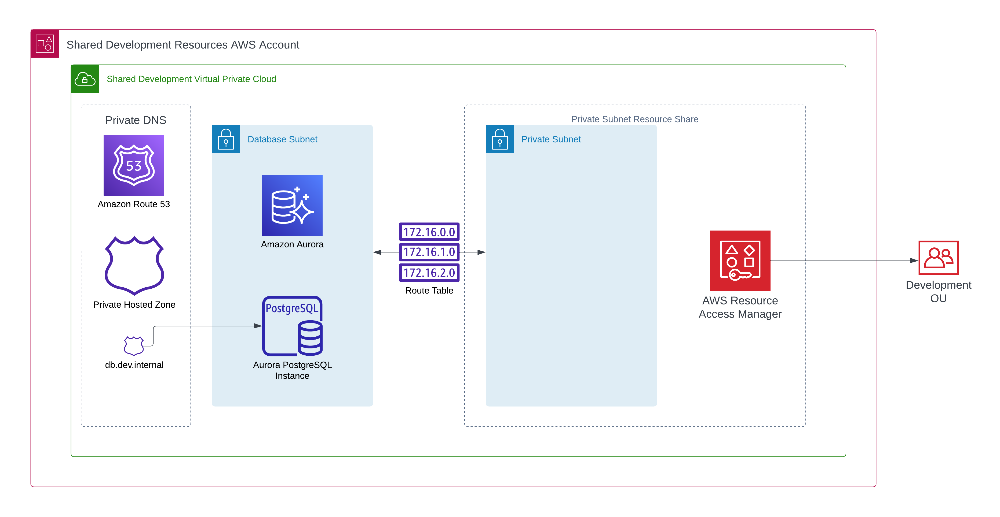
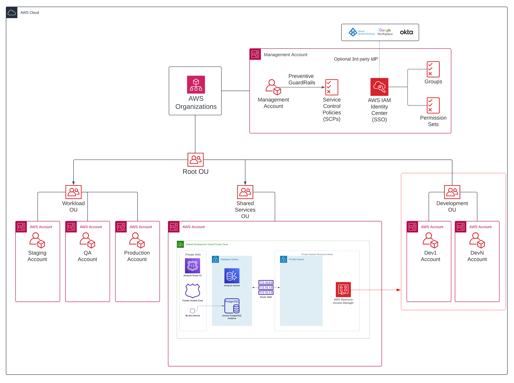

# Using AWS Resource Access Manager to share an Aurora cluster for development

This is a demo repo that accompanies the following [blog post](https://fourtheorem.com/using-aws-resource-access-manager-for-development)

## Pre-requisites 

If you have an existing AWS Organization managed with terraform you will need to add
`ram.amazonaws.com` as a `aws_service_access_principals` in your `aws_organizations_organization` resource, alternatively
you can enable the RAM integration using the aws cli `aws ram enable-sharing-with-aws-organization`

## Terraform setup

I recommend using [tfenv](https://github.com/tfutils/tfenv) to manage multiple terraform versions, on macOS you can run
`brew install tfenv` to install. You can then run `tfenv install` which will intall the correct terraform version defined
in `.terraform-version`

Alternatively this should run with any recent version of terraform.

## Deploy

1. Deploy the [organization](./organization) or modify it to suit your needs, or skip this step entirely as you have a suitable
organization in place
2. Deploy the [shared](./shared) module and provide the arn of the development Organizational Unit
3. Deploy the [developer_account](./developer_account) module which deploy an EC2 instance in the shared subnet, you must
provide a subnet id. The shared module will output the subnet IDs of the shared subnets.

Further details are provided in each module readme.
